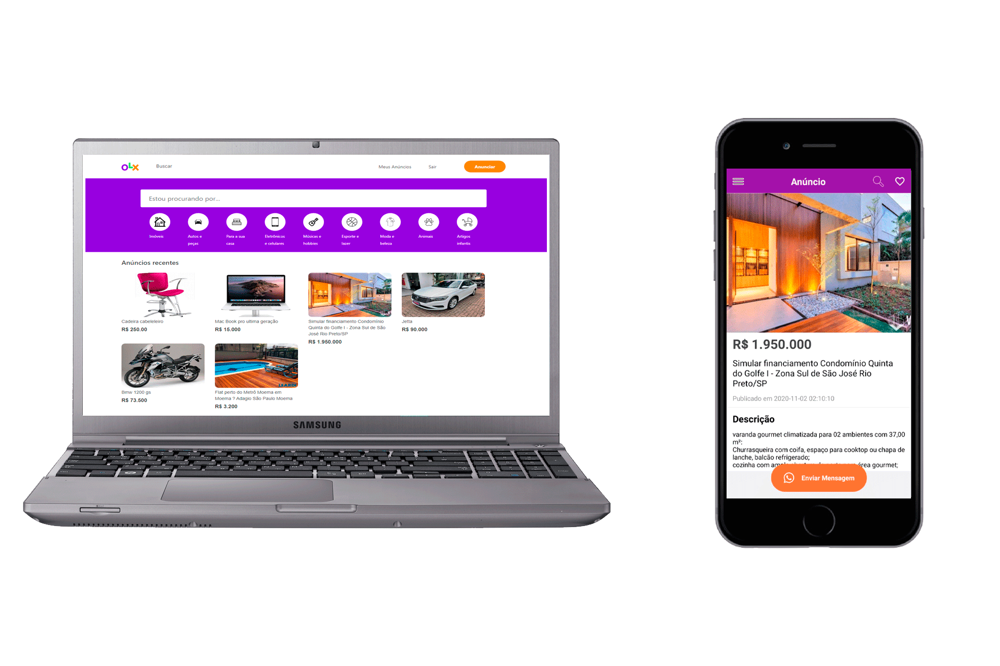

<h1 align="center">
    
    <br>Projeto fullstack OLX Clone<br/>
    Laravel | ReactJS | React Native
</h1> 

<p align="center">
  <a href="#bookmark-sobre">Sobre</a>&nbsp;&nbsp;&nbsp;|&nbsp;&nbsp;&nbsp;
  <a href="#rocket-tecnologias">Tecnologias</a>&nbsp;&nbsp;&nbsp;|&nbsp;&nbsp;&nbsp;
  <a href="#boom-como-executar">Como Executar</a>&nbsp;&nbsp;&nbsp;|&nbsp;&nbsp;&nbsp;
</p>

## :bookmark: Sobre

O **Projeto** é uma copia do OLX com o desafio de criar todas suas funcionalidades tanto no frontend como no backend, foi feito apenas para treinar habilidades **fullstack**.
  


## :rocket: Tecnologias
-  [Laravel](https://laravel.com/)
-  [ReactJS](https://reactjs.org/)
-  [React Native](http://facebook.github.io/react-native/)
-  [axios](https://github.com/axios/axios)

## :boom: Como Executar

- ### **Pré-requisitos**

  - É **necessário** possuir o **[Laravel](https://laravel.com/)** instalado no computador
  - É **necessário** possuir o **[Git](https://git-scm.com/)** instalado e configurado no computador
  - Também, é **preciso** ter um gerenciador de pacotes seja o **[NPM](https://www.npmjs.com/)** ou **[Yarn](https://yarnpkg.com/)**.

1. Faça um clone do repositório:

```sh
  $ git clone https://github.com/matheuspdias/olx.git
```

2. Executando a Aplicação:

```sh
  # IMPORTE O ARQUIVO OLXAPI.SQL PARA SUA MAQUINA PELO PHPMYADMIN
  # API
  $ cd olx
  $ cd backend
  # Instalando as dependências do projeto.
  $ composer install --no-scripts
  # renomeio o arquivo env.example para .env
  $ no arquivo .env use DB_DATABASE=olxlaravel ou o nome que você colocou no db
  # Gere uma nova chave para a aplicação laravel:
  $ php artisan key:generate
  # Publicar configuração de JWT
  $ php artisan vendor:publish --provider="Tymon\JWTAuth\Providers\LaravelServiceProvider"
  $ depois execute php artisan jwt:secret
  # Inicie a API
  $ php artisan serve --host=0.0.0.0

  # Aplicação web
  $ cd olx
  $ cd frontend
  # Instalando as dependências do projeto.
  $ yarn ou npm install
  # configurando arquivo api.js
  $ troque o baseURL: para 'http://ipdasuamaquina:8000/api'
  # Inicie a aplicação web
  $ yarn start ou npm start

  # Aplicação mobile
  $ cd olx
  $ cd mobile
  # Instalando as dependências do projeto.
  $ yarn ou npm install
  # configurando arquivo api.js
  $ troque o baseURL: para 'http://ipdasuamaquina:8000/api'
  # Inicie a aplicação mobile
  $ npx react-native run-android
```
